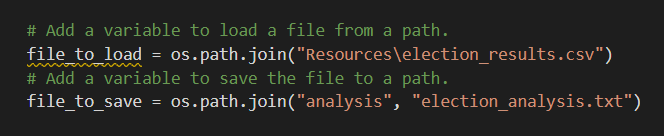

# Election_Analysis

## Overview of Election Audit 

The purpose of this analysis is to help Tom, who is a Colorado Board of Elections employee, on the audit of the tabulated results for the US Congressional precinct in Colorado.
The goal is to report the followings data:

•	Total number of votes cast

•	A complete list of candidates who received votes

•	Total number of votes each candidate received

•	Percentage of votes each candidate won

•	The winner of the election based on popular vote

## Resources

-	Data source: election_results.csv
-	Software utilized: Python and VS code 

## Election-Audit Results

- The candidates who received votes were: Charles Casper Stockham, Diana DeGette and Raymon Anthony Doane.
- They were a total of 369.711 votes cast on this election. 
- The detail of the votes cast in each county is the following one:
```
-Jefferson: 10.50% (38,855 votes)

-Denver: 82.78% (306,055 votes)

-Arapahoe: 6.70% (24,801 votes)
```

-	Being Denver the county with more votes among all.

-	The detailed list of the candidates with the votes and its percentage is:
 ```
-Charles Casper Stockham: 23.0% (85,213 votes)

-Diana DeGette: 73.8% (272,892 votes)

-Raymon Anthony Doane: 3.1% (11,606 votes
 ```
 
- Based on the analysis, we conclude that this is the following winner:
 ```
-Winner: Diana DeGette

-Winning Vote Count: 272,892

-Winning Percentage: 73.8%
 ```
 
## Election-Audit Summary

Since this piece of code is working correctly, I will recommend it for future elections, with a few modifications.

-	The path of the new data base as well as the new archive where the analysis is going to be saved, must be replaced.
 


